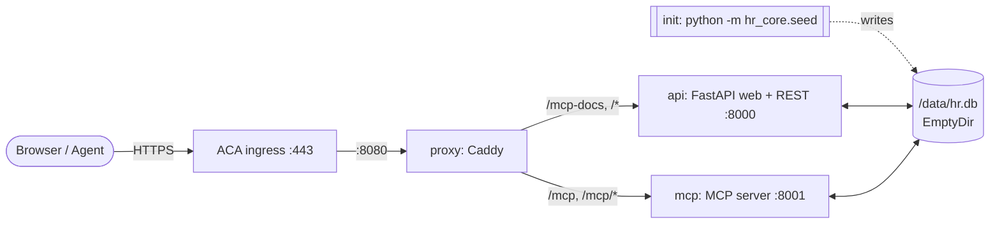
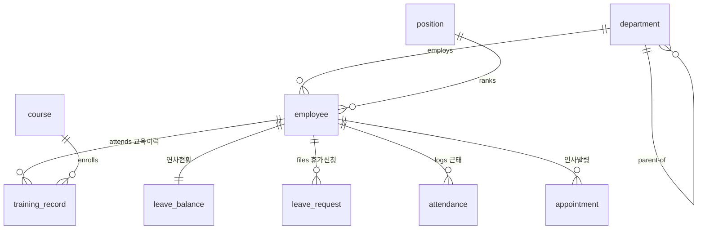
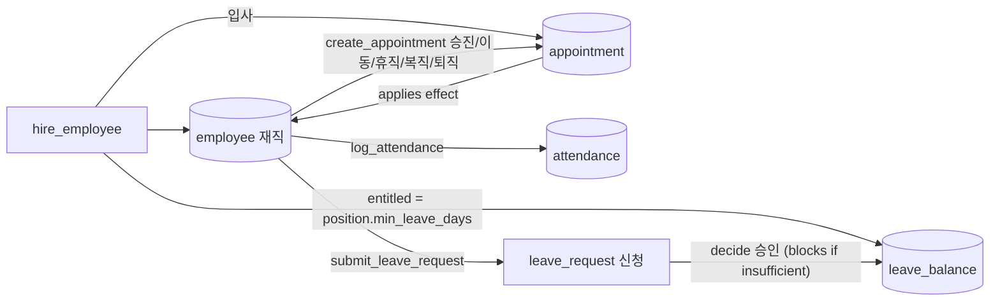

# mock-hr-kr

A **throwaway, on-demand mock HR system** (HRIS) for a **general enterprise**,
built purely as a **connection point for agent demos**. One shared SQLite
database — modelling an **org of employees** across departments and positions,
with training, annual-leave balances, attendance, and personnel appointments —
is exposed through **three surfaces**:

| Surface | Audience | Endpoint | Scope |
| --- | --- | --- | --- |
| **Web console** | Human | `/` | All HR functions (view + input) + dashboard |
| **REST API** | Agent / key | `/api` (docs: `/api/docs`) | Employee · Department · Position · Course · Training · Appointment |
| **MCP server** | Agent / key | `/mcp` (docs: `/mcp-docs`) | Attendance · Leave (+ employee lookup) |

Both agent surfaces are documented in the console: REST through OpenAPI at
**`/api/docs`**, MCP through **`/mcp-docs`** — a reference page generated from
the live `FastMCP` server (tool schemas, capabilities, client config), so it can
never drift from what `tools/list` actually returns.

> **MVP / demo only.** The database is **ephemeral** — it lives on a volume tied
> to the running replica, so a redeploy resets it to the seeded snapshot. The
> seed is a *bootstrap*, not a reset: restarts leave existing rows alone. See
> [Data lifecycle](#data-lifecycle). A single shared demo key (`changjuahn`)
> gates the agent surfaces; there is no real security.

---

## Architecture

A **single** Azure Container App (Consumption, one always-on replica).
All containers in the replica share one **`EmptyDir` volume** mounted
at `/data`, holding `hr.db`.



| Container | Image | Role |
| --- | --- | --- |
| **seed** (init) | `mock-hr-app` | Runs `python -m hr_core.seed` before app containers start; bootstraps `hr.db` only if empty, then exits |
| **api** | `mock-hr-app` | FastAPI/Uvicorn on `:8000` — web console (`/`) + REST (`/api`) + MCP reference (`/mcp-docs`) |
| **mcp** | `mock-hr-app` | MCP streamable HTTP on `:8001` at `/mcp` |
| **proxy** | `mock-hr-proxy` | Caddy on `:8080` — single external ingress, routes `/mcp-docs*` → api, `/mcp`+`/mcp/*` → mcp, `/*` → api |

Two public GHCR images are built by `.github/workflows/images.yml`:
`ghcr.io/changju-ahn/mock-hr-app` and `ghcr.io/changju-ahn/mock-hr-proxy`.

Sizing: each container **0.25 vCPU / 0.5 GiB** (ACA minimum), `minReplicas=1`
(always on, so the per-replica `EmptyDir` DB is not discarded when idle),
`maxReplicas=1`.

---

## Data model

Nine tables spanning the org (departments, positions, employees), learning
(courses, training records), and the day-to-day operational records (leave
balances, leave requests, attendance, appointments).

| Table | 한글 | Key columns |
| --- | --- | --- |
| `department` | 부서 | dept_code, dept_name, parent_dept_code, manager_emp_id, cost_center |
| `position` | 직급 | position_code, position_name, level_no, min_leave_days |
| `employee` | 사원 | emp_id, name, dept_code, position_code, employment_type, status (`재직`/`휴직`/`퇴직`), hire_date, manager_emp_id |
| `course` | 교육과정 | course_code, course_name, category, delivery, hours, is_mandatory |
| `training_record` | 교육이력 | emp_id, course_code, enroll_date, complete_date, status (`수강중`/`이수`/`미이수`), score |
| `leave_balance` | 연차현황 | emp_id, year, entitled_days, used_days, remaining_days |
| `leave_request` | 휴가신청 | emp_id, leave_type, start_date, end_date, days, status (`신청`/`승인`/`반려`/`취소`), approver_emp_id |
| `attendance` | 근태 | emp_id, work_date, check_in, check_out, work_hours, overtime_hours, status (`정상`/`지각`/`조퇴`/`결근`/`휴가`/`재택`) |
| `appointment` | 인사발령 | emp_id, effective_date, type (`입사`/`승진`/`부서이동`/`휴직`/`복직`/`퇴직`), from_dept, to_dept, from_position, to_position |

### Entity-relationship diagram



---

## Process flow

```
입사(hire) ──▶ 연차부여(leave_balance) + 발령(입사) ──▶ 근태/교육/휴가 ──▶ 승진·이동·휴직·복직·퇴직(appointment)
```

1. **`hire_employee`** — create an employee (`status=재직`), auto-assign the next
   `emp_id` (`E0001`, `E0002`, …). Hiring atomically:
   - grants an annual-leave balance for the year (`entitled_days` =
     the position's `min_leave_days`, `used=0`, `remaining=entitled`);
   - writes an `입사` (hire) **appointment** row.
2. **Attendance** — `log_attendance` upserts one row per (emp_id, work_date).
   `work_hours = (check_out − check_in) − 1h lunch`, `overtime = max(0, work − 8)`,
   and the status is auto-classified: **지각** if `check_in > 09:00`, **조퇴** if
   `check_out < 18:00`, **결근** if no `check_in`, else **정상** (an explicit
   status such as `휴가`/`재택` overrides).
3. **Training** — enroll an employee in a course (`status=수강중`); completing it
   sets `status=이수` with a `complete_date` (and optional score).
4. **Leave** — `submit_leave_request` files a request (`status=신청`); `days` is the
   inclusive `start..end` span (반차 = 0.5). Deciding it:
   - **승인** decrements the employee's remaining annual leave; this **blocks**
     (raises an error, nothing changes) if the remaining balance is insufficient.
   - **반려 / 취소** just set the status; the balance is untouched.
5. **Appointment** — `create_appointment` records a personnel action and applies
   its effect: **승진** changes the position, **부서이동** changes the department,
   **휴직** sets `status=휴직`, **복직** restores `재직`, **퇴직** sets `status=퇴직`.

### Transaction flow



---

## Surfaces & endpoints

### Web console — `/` (all open, no key)

The web console uses a SuccessFactors-inspired hybrid experience: a
Morning Horizon-style card dashboard for quick actions and attention items,
with compact administrator workspaces for master and operational records.
All read-only tables keep identifiers/codes and names in separate columns.

| Page | URL | Actions |
| --- | --- | --- |
| Dashboard | `/` | Summary: headcount, org, leave, training, recent actions |
| Employees | `/employees` | List + filter; hire an employee |
| Employee detail | `/employees/{emp_id}` | Profile, leave, attendance, training, appointments |
| Departments | `/departments` | Org tree + managers |
| Positions | `/positions` | Position/rank list |
| Courses | `/courses` | Catalogue + records; enroll / complete |
| Leave | `/leave` | List + submit; approve / reject |
| Attendance | `/attendance` | List + filter; log attendance |
| Appointments | `/appointments` | List; create a personnel action |
| Guide | `/guide` | Step-by-step usage walkthrough |
| MCP docs | `/mcp-docs` | MCP reference: tools, schemas, client setup (open, no key) |

### REST API — `/api` (requires `X-API-Key: changjuahn`)

Interactive docs at **`/api/docs`** (open — no key needed to browse).

| Method | Endpoint | 기능 |
| --- | --- | --- |
| `GET` | `/api` | Index + endpoint list |
| `GET` | `/api/health` | DB status + row counts |
| `GET` | `/api/departments` | Department list (`?parent_dept_code`) |
| `GET` | `/api/departments/tree` | Departments in org-tree order (with `depth`) |
| `GET` | `/api/departments/{dept_code}` | One department |
| `GET` | `/api/positions` | Position list |
| `GET` | `/api/employees` | Employees (`?dept_code`, `?position_code`, `?status`, `?employment_type`, `?manager_emp_id`, `?q`, `?limit`) |
| `GET` | `/api/employees/{emp_id}` | One employee with leave / attendance / training / appointments |
| `POST` | `/api/employees` | Hire an employee (grants leave + 입사 appointment) |
| `GET` | `/api/courses` | Course catalogue (`?category`, `?is_mandatory`) |
| `GET` | `/api/training-records` | Training records (`?emp_id`, `?course_code`, `?status`, `?limit`) |
| `POST` | `/api/training-records` | Enroll an employee in a course |
| `POST` | `/api/training-records/{record_id}/complete` | Complete a training record |
| `GET` | `/api/appointments` | Appointments (`?emp_id`, `?type`, `?date_from`, `?date_to`, `?limit`) |
| `POST` | `/api/appointments` | Create a personnel action (applies its effect) |

### MCP server — `/mcp` (requires `X-API-Key: changjuahn`)

Streamable HTTP (`stateless_http=True`, so no session id and no `initialize`
round-trip is required before `tools/list`). Nine tools:

| Tool | 기능 |
| --- | --- |
| `log_attendance` | Upsert a day's attendance; derives hours/overtime + status |
| `list_attendance` | Attendance rows (emp_id?, work_date?, status?, date range?) |
| `get_attendance_summary` | Roll up by status (month?, dept_code?, work_date?) |
| `submit_leave_request` | File a leave request; returns non-blocking balance_warning |
| `decide_leave_request` | Approve/reject; 승인 blocks on insufficient balance |
| `get_leave_balance` | Annual-leave entitled/used/remaining for a year |
| `list_leave_requests` | Leave requests (emp_id?, status?, leave_type?, date range?) |
| `list_employees` | Employees for picking an emp_id (filters + `q` search) |
| `get_employee` | One employee with full context |

Tools returning a list are advertised with a wrapped output schema — the result
arrives as `structuredContent.result`; dict-returning tools put the object
directly in `structuredContent`.

### MCP reference — `/mcp-docs` (open — no key needed to browse)

The MCP counterpart of `/api/docs`. `api/mcp_docs.py` introspects the **live**
`FastMCP` object from `mcp_server.server` — the same one that answers `/mcp` —
and renders:

- what MCP is, and how it differs from the REST surface;
- connection details (endpoint, transport, protocol version, auth header, stateless);
- server capabilities (`tools` yes; `resources`/`prompts` explicitly empty) and supported JSON-RPC methods;
- every tool with its parameter table (type / required / default / allowed values),
  the `structuredContent` shape, a runnable `tools/call` body, a Python snippet,
  and the raw `inputSchema` / `outputSchema`;
- copy-paste client config for VS Code, Claude Desktop, the Python SDK, and curl.

Examples are filled with identifiers read from the seeded database (an existing
employee, the busiest department, a leave request still in `신청`), so every
example on the page runs as-is.

`GET /mcp-docs/spec.json` returns the same document as JSON — the MCP analogue
of `/api/openapi.json`.

---

## Agent connection examples

### curl — REST

```bash
# Active employees in a department
curl -H "X-API-Key: changjuahn" "https://<fqdn>/api/employees?dept_code=D200&status=재직"

# Hire an employee → grants leave balance + 입사 appointment
curl -X POST "https://<fqdn>/api/employees" \
  -H "X-API-Key: changjuahn" \
  -H "Content-Type: application/json" \
  -d '{"name": "홍길동", "dept_code": "D200", "position_code": "P3"}'
```

### Python — MCP

```python
import asyncio
from mcp import ClientSession
from mcp.client.streamable_http import streamablehttp_client

async def main():
    url = "https://<fqdn>/mcp"
    headers = {"X-API-Key": "changjuahn"}
    async with streamablehttp_client(url, headers=headers) as (r, w, _):
        async with ClientSession(r, w) as s:
            await s.initialize()
            # Log today's attendance for an employee
            att = await s.call_tool("log_attendance",
                                    {"emp_id": "E0001", "work_date": "2026-07-20",
                                     "check_in": "09:05", "check_out": "18:30"})
            print(att)
            # Roll up attendance for the month
            summary = await s.call_tool("get_attendance_summary", {"month": "2026-07"})
            print(summary)

asyncio.run(main())
```

### curl — MCP

The server is stateless, so a single request works with no `initialize`
handshake and no session id. Responses come back as SSE, so `Accept` must list
both content types:

```bash
curl -X POST "https://<fqdn>/mcp" \
  -H "X-API-Key: changjuahn" \
  -H "Content-Type: application/json" \
  -H "Accept: application/json, text/event-stream" \
  -d '{"jsonrpc":"2.0","id":1,"method":"tools/list"}'
```

Popular MCP clients (e.g. Claude Desktop, VS Code) can point directly at
`https://<fqdn>/mcp` (transport: streamable HTTP) with header `X-API-Key: changjuahn`.
Ready-made config for each client is on **`https://<fqdn>/mcp-docs`**.

---

## Local development

```bash
python3.12 -m venv .venv && . .venv/bin/activate
pip install -r requirements.txt

# Seed the DB (creates data/hr.db; add --force to regenerate an existing one)
HR_DB_PATH=$(pwd)/data/hr.db python -m hr_core.seed

# Terminal 1 — web console + REST API
uvicorn api.main:app --port 8000

# Terminal 2 — MCP server (serves /mcp on :8001)
python -m mcp_server
```

Browse: <http://localhost:8000/> · <http://localhost:8000/api/docs> · <http://localhost:8000/mcp-docs>  
MCP endpoint: `http://localhost:8001/mcp`

Run tests:

```bash
python -m unittest hr_core.test_db api.tests.test_app mcp_server.test_server
```

---

## Deploy / redeploy / teardown

Images are built and pushed to public GHCR by CI — Azure needs no registry credentials.

**1 · Push branch** → `.github/workflows/images.yml` builds and pushes:
- `ghcr.io/changju-ahn/mock-hr-app:latest`
- `ghcr.io/changju-ahn/mock-hr-proxy:latest`

Ensure both packages are set to **Public** in GitHub (Packages → *Package settings* → *Change visibility*). One-time step per package.

**2 · Deploy**

```bash
./infra/deploy.sh          # defaults: rg=rg-mock-hr-kr, region=koreacentral
# Override:
RG=rg-mock-hr-kr LOCATION=koreacentral ./infra/deploy.sh
```

The script creates the resource group and deploys `infra/main.bicep` (ACA
environment + Container App). It prints the three live endpoints on completion.

**3 · Redeploy** (pick up a new `:latest`):

```bash
az containerapp update -g rg-mock-hr-kr -n mock-hr \
  --revision-suffix "r$(date +%s)"
```

Each new revision starts a new replica with an empty volume, so the seed init
container rebuilds the snapshot — **rows added since the last start are lost**.

**4 · Teardown**

```bash
az group delete -n rg-mock-hr-kr --yes --no-wait
```

---

## Cost notes

- `minReplicas=1`: one replica runs continuously. Scale-to-zero would be
  cheaper, but the SQLite file is per-replica, so idling to zero would discard
  everything written since the last start (see [Data lifecycle](#data-lifecycle)).
- Each container: **0.25 vCPU / 0.5 GiB** (ACA minimum); three app containers
  total **0.75 vCPU / 1.5 GiB** per replica.
- Single replica (`maxReplicas=1`): the shared `EmptyDir` SQLite is per-replica.
- Public GHCR images → **no** Azure Container Registry needed.

---

## Data lifecycle

The SQLite file sits on an `EmptyDir` volume, which lives and dies with the
replica. What that means in practice:

| Event | Data written via REST/MCP |
| --- | --- |
| Container restart within the replica | **kept** — the seed skips a populated DB |
| Scale to zero, then back up | **lost** — hence `minReplicas=1` |
| New revision (redeploy) | **lost** — a new replica gets a new empty volume |

`python -m hr_core.seed` is a **bootstrap, not a reset**. It runs as the ACA init
container on every replica start, and does nothing when the database already
holds rows, so restarting never destroys data that agents or external
key-authenticated callers wrote. Regenerating the snapshot is opt-in:

```bash
python -m hr_core.seed --force     # or: HR_SEED_FORCE=1 python -m hr_core.seed
```

Nothing else deletes data: there are no `DELETE` endpoints on the REST, web, or
MCP surfaces (every route is a GET or POST), and the schema has no
`ON DELETE CASCADE`. `reset_db()` is the only row-deleting function and the
forced seed is its only caller.

The API key is **not** stored in the database — it comes from the `HR_API_KEY`
environment variable (default `changjuahn`), injected from the revision
template on every start, so resetting the data never changes or removes it.

**To survive redeploys**, replace the `EmptyDir` volume in `infra/main.bicep`
with an Azure Files share. Note that SQLite's WAL journal does not work over
SMB, so `hr_core/db.py` would also need `journal_mode` switched away from WAL,
and the concurrent `api` + `mcp` writers would then contend on SMB file locks.

---

## Seeded data snapshot

Written once when the database is empty (deterministic):

| Entity | Count |
| --- | --- |
| Departments | 10 (all with a manager) |
| Positions | 7 |
| Employees | 34 (재직 31 / 휴직 1 / 퇴직 2) |
| Courses | 10 (5 mandatory) |
| Training records | **212** |
| Leave balances | 34 (one per employee, year 2026) |
| Leave requests | 23 (승인 17 / 신청 4 / 반려 2) |
| Attendance | **310** (31 active × 10 weekdays) |
| Appointments | **43** (입사 34 + 승진/이동/휴직/복직/퇴직 9) |

> **Note:** identifiers are stable — `E0001`, `D200`, `P3` and friends come back
> identically whenever the snapshot is regenerated, so external tests can rely
> on them. Rows *added* after seeding are only as durable as the replica.
